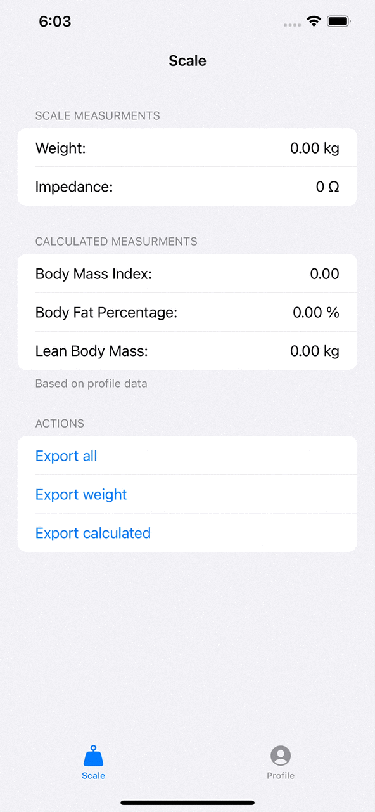
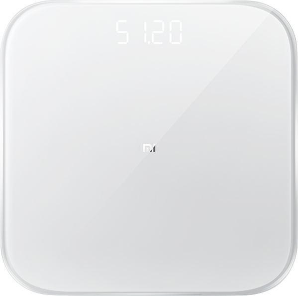

# Apple Watch App for Xiaomi MiScale 2
Reads Xiaomi body scale measurements, makes extra parameters calculation, and adds these data to Apple Health

### What problems does this app solve:
1. No official app for Apple Watch so far
2. All your personal data is stored locally in contrast to the official iOS app
 

  
  
  
  
  

## Features:
* Read the weight measurements
* Read the impedance measurements
* Calculate body mass index (BMI)
* Calculate body fat percentage (BFP)
* Calculate lean body mass (LBM)

## How does it work:
Before using switch to the "Profile" tab to insert your biometric data. Please note, **watch and phone apps don't synchronize it**. 

1. Open the app on your watch or phone
2. Get on the scale
3. Wait for impedance measurements to finish (the app will track measurement automatically)
4. Export the scale data, calculated data, or both to Apple Health by pressing the corresponding button

## Technical details:
* Measurements are handled over BLE protocol (Bluetooth Low Energy).
* Apple Watch operates as a central device and reads measurements only when the screen is "on".
* It uses Core Bluetooth under the hood
* Predefined BLE service UUID used by Xiaomi in miScale2 (1 gen. as well) is "181B"
* Data is 17 bytes long, with the first 4 bytes being a UUID, the other **13 bytes** are the payload:
  * bytes 9 and 10 are impedance
  * bytes 11 and 12 are weight (*100 for pounds and catty, *200 for kilograms)
* The data format is little-endian

For more details please **see the comments on the source files**.

## References:
* [Reading Xiaomi Mi Scale data with Web Bluetooth Scanning API][1] (starting point)
* [miScale 2 unofficial documentation][2]
* ["Getting Started with Bluetooth Low Energy"][3] (BLE detailed guide book)
* [Body metrics formulas][4] (in Pyhon)
* [Utils for body metrics formulas][5] (in Python)
* [miScale 1gen iOS app][6] 
* [How to convert data into little endian format?][7]

[1]: https://dev.to/henrylim96/reading-xiaomi-mi-scale-data-with-web-bluetooth-scanning-api-1mb9
[2]: https://github.com/wiecosystem/Bluetooth/blob/master/doc/devices/huami.health.scale2.md
[3]: https://www.oreilly.com/library/view/getting-started-with/9781491900550/
[4]: https://github.com/wiecosystem/Bluetooth/blob/master/sandbox/huami.health.scale2/body_metrics.py
[5]: https://github.com/wiecosystem/Bluetooth/blob/master/sandbox/huami.health.scale2/body_scales.py
[6]: https://github.com/theslash/ios_mi_scale
[7]: https://stackoverflow.com/questions/44496320/how-to-convert-data-into-little-endian-format
